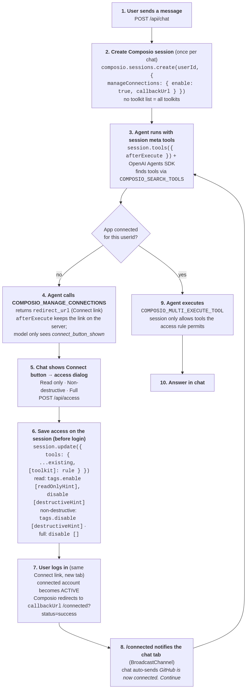
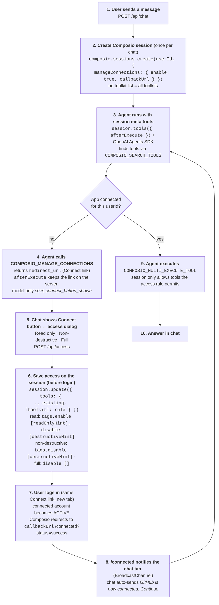

# Composio session connect demo

A small chat assistant that can use **any Composio app**. When the assistant needs an app you haven't connected, it shows a **Connect** button in the chat. Clicking it lets you choose what the assistant may do in that app (read only / non-destructive / full) **before** you log in. That choice is saved on the Composio session. After you log in, the chat picks up where it left off.

About 150 lines of server code and one HTML page. No framework, no database.

## Run it (Node 22+)

```bash
cp .env.example .env    # add your COMPOSIO_API_KEY and OPENAI_API_KEY
npm run dev             # installs deps, then starts the server
```

Open http://localhost:3941 and try:

- `list my GitHub repos`
- `summarize my 5 latest unread emails`
- `what are the top 3 stories on Hacker News?` (no login needed)

| Variable | Required | Default | What it is |
| --- | --- | --- | --- |
| `COMPOSIO_API_KEY` | yes | | From [platform.composio.dev](https://platform.composio.dev) → Settings → API keys |
| `OPENAI_API_KEY` | yes | | Model calls are billed to this key |
| `OPENAI_MODEL` | no | `gpt-5.5` | Any OpenAI model the Agents SDK supports |
| `COMPOSIO_USER_ID` | no | `demo_user` | The Composio user the connections belong to |
| `PORT` | no | `3941` | Local port |

## How it works



<details><summary>Mermaid source</summary>




</details>

### The Composio pieces

| Step | Call | Why |
| --- | --- | --- |
| Create session | `composio.sessions.create(userId, { manageConnections: { enable: true, callbackUrl } })` | No toolkit list means every toolkit is available. `callbackUrl` is where Composio sends the login tab when auth finishes. |
| Give the agent tools | `session.tools({ afterExecute })` with `@composio/openai-agents` | Returns the 4 meta tools. The SDK executes them; `afterExecute` lets the app catch the connect link so it never passes through the model. |
| Connect an app | `COMPOSIO_MANAGE_CONNECTIONS` (called by the agent) | Returns a Composio Connect link (`redirect_url`) per toolkit. |
| Set access | `session.update({ tools: { [toolkit]: rule } })` | Saves a per-toolkit tool rule on the session. `tools` replaces the whole map, so the server merges in the existing rules first. |
| Use the app | `COMPOSIO_SEARCH_TOOLS` → `COMPOSIO_MULTI_EXECUTE_TOOL` | The session only lets the agent run tools the rule allows. |

### Access options

Rules use the tool behavior hint tags on Composio tools:

| Option | Session rule for the toolkit |
| --- | --- |
| Read only | `{ tags: { enable: ["readOnlyHint"], disable: ["destructiveHint"] } }` |
| Non-destructive | `{ tags: { disable: ["destructiveHint"] } }` |
| Full access | `{ disable: [] }` |

## Things to know

- **Access is per session; connections are per user.** The access choice lives on the session. The login (connected account) belongs to `COMPOSIO_USER_ID` and is reused by later sessions, which start with full access unless you set a rule again. In production, store the user's choice and apply it to each new session.
- **Rules apply to one toolkit.** Read-only on Google Sheets doesn't restrict Google Drive, so the agent may reach a similar action through another app.
- **Non-destructive depends on tags.** Tools with no `destructiveHint` tag are allowed, including some untagged write actions.
- **OAuth scopes are separate.** The access option limits which tools the agent can run. It doesn't change the scopes the user grants at login.
- **Demo only:** chats live in memory, there's no user auth, and the server listens on localhost.

## Files

| File | What it does |
| --- | --- |
| `server.mjs` | Composio session, OpenAI agent, and the 4 routes: `/`, `/connected`, `/api/chat`, `/api/access` |
| `index.html` | Chat UI, Connect button, access dialog, resume after login |
| `connected.html` | Callback page Composio redirects to after login; tells the chat tab, then closes |

Docs: [Sessions](https://docs.composio.dev/reference/sdk-reference/typescript/session) · [Authentication](https://docs.composio.dev/docs/authentication) · [Manage connections](https://docs.composio.dev/toolkits/meta-tools/manage_connections)
